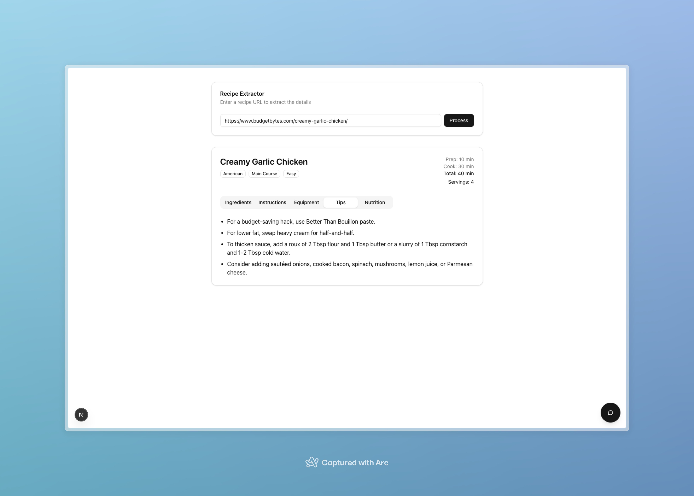

# RecipeAssistantLangChainTavily: AI-Powered Recipe Analysis and Chatbot
RecipeLangChain is an innovative web application that combines the power of web scraping, natural language processing, and AI to provide users with detailed recipe information and an intelligent chatbot for culinary queries.

## Features
- Recipe URL Analysis: Users can input a recipe URL to get comprehensive details about the dish.
- Intelligent Data Extraction: The application scrapes recipe content and parses it into structured data.
- Detailed Recipe Breakdown: Provides information on ingredients, instructions, preparation steps, required equipment, and nutritional facts.
- AI-Powered Chatbot: An intelligent assistant for answering cooking-related questions.
- RAG (Retrieval-Augmented Generation): Enhances chatbot responses with relevant information from the recipe database.

## Screenshots

<div style="display: flex; flex-wrap: wrap; gap: 20px; justify-content: center;">   </div> <br> <div style="display: flex; flex-wrap: wrap; gap: 20px; justify-content: center;">   </div> <br> <div style="display: flex; justify-content: center;">  </div>

## Architecture
The project is divided into two main components:

### Frontend (Next.js)
- Provides a user-friendly interface for inputting recipe URLs and interacting with the chatbot.
- Displays parsed recipe information in a structured format.
- Implements the chat interface for user queries.

### Backend (Flask)
- Handles web scraping of recipe URLs using Tavily.
- Processes and chunks the scraped data.
- Stores processed information in a local ChromaDB instance.
- Utilizes LangChain for advanced natural language processing tasks.
- Implements the chatbot logic, including query refinement and response generation.

## Technologies Used
- Frontend: Next.js (React framework)
- Backend: Flask (Python web framework)
- Web Scraping: Tavily
- Natural Language Processing: LangChain
- Vector Database: ChromaDB
- AI/ML: Various models integrated through LangChain

## Setup and Installation
Acquire a Tavily API key and an OpenAI API key. Add these to a .env file at the root of the project.

Install the backend dependencies by creating a virtual environment and running:
```
cd backend
pip install -r requirements.txt
```
and you can run the backend Flask server by running:
```
python3 app.py
```

For the frontend, in a new terminal run:

```
cd frontend
npm install
npm run dev
```

## Usage
### Recipe Analysis
1. Enter a recipe URL in the provided input field.
2. The application will scrape the content using Tavily.
3. The scraped data is processed, chunked, and stored in ChromaDB.
4. LangChain parses the data to extract:
- Ingredients
- Cooking instructions
- Preparation steps
- Required equipment
- Nutritional information
5. The parsed information is displayed in a user-friendly format.

### Chatbot Interaction
1. Type your culinary question into the chat interface.
2. The system evaluates and refines your query for optimal processing.
3. Based on the query, the chatbot either:
- Retrieves relevant documents from the ChromaDB (for RAG)
- Generates a response using a standard language model
4. A comprehensive answer is generated and displayed in the chat.

## How It Works
### Data Processing Pipeline
1. Web Scraping: Tavily extracts raw content from the provided recipe URL.
2. Data Chunking: The scraped content is divided into manageable chunks.
3. Storage: Processed chunks are stored in a local ChromaDB instance for efficient retrieval.
4. Information Extraction: LangChain analyzes the stored data to extract structured recipe information.

### Chatbot Functionality
1. Query Refinement: User input is analyzed and refined to ensure optimal understanding.
2. Retrieval or Generation: The system decides whether to retrieve relevant documents (RAG) or generate a response from scratch.
3. Response Generation: Using the retrieved information or direct language model output, a comprehensive answer is formulated.
